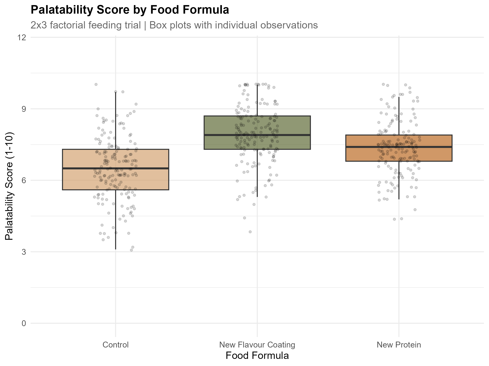
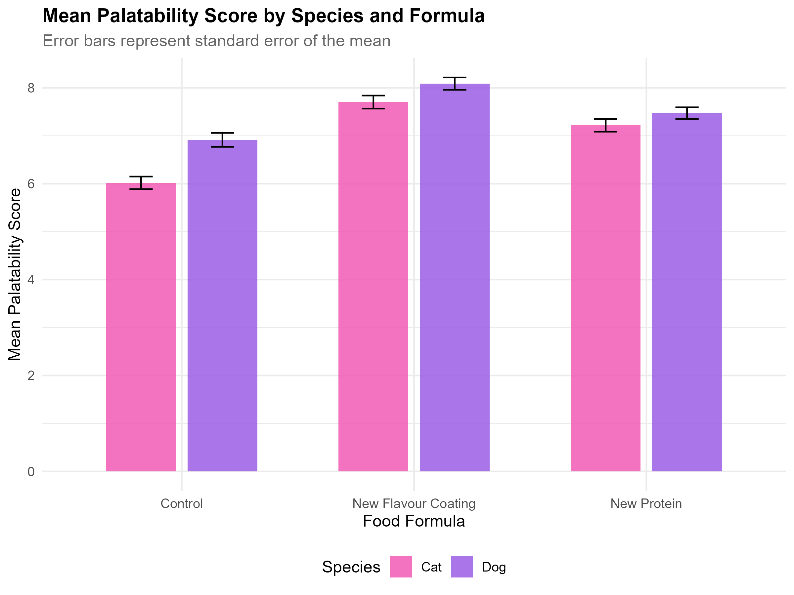
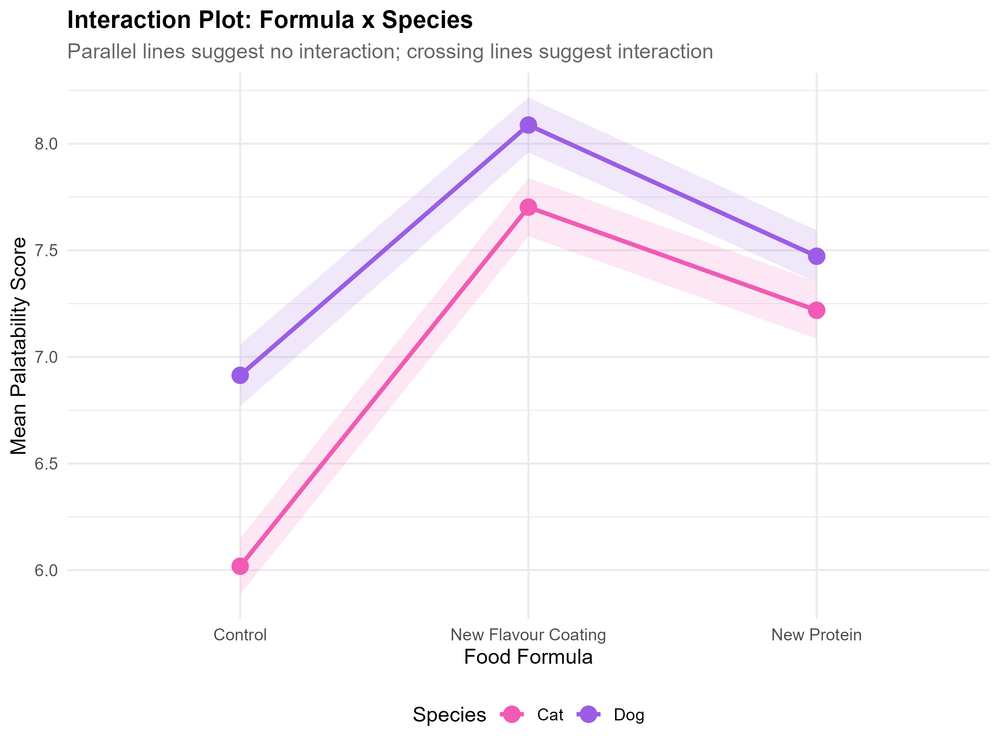
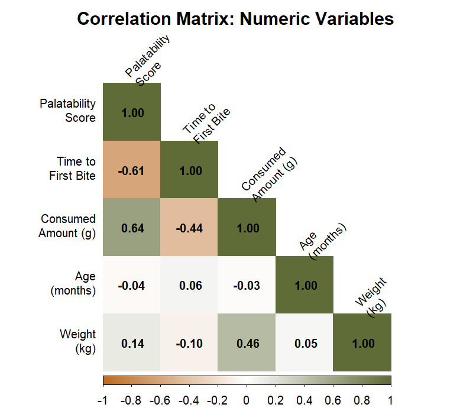
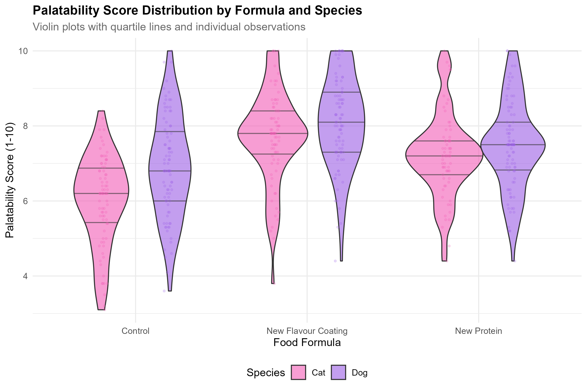

# R-based Statistical Analysis of Pet Food Palatability Trials

A complete analysis pipeline for a 2x3 factorial feeding trial, built in R. This project demonstrates classical hypothesis testing on pet food palatability data — the kind of experiment a pet food R&D team runs regularly.

## Motivation

Pet food companies like Mars conduct thousands of palatability trials each year to evaluate new formulations. This project takes that real-world workflow and builds a reproducible, well-documented analysis pipeline that covers data quality assessment, cleaning, statistical testing, visualization, and data lake export.

## Experimental Design

| Factor | Levels |
|--------|--------|
| **Pet Species** | Dog, Cat |
| **Food Formula** | A (Control), B (New Protein), C (New Flavour Coating) |

**Design:** 2x3 factorial with ~500 observations. Each pet receives one formula. Response variables include palatability score (1-10), time to first bite (seconds), and consumed amount (grams).

## Project Structure

```
pet-food-palatability-analysis/
├── generate_data.R              # Creates synthetic messy dataset
├── requirements.R               # Package dependencies
├── README.md
├── data/
│   ├── raw/                     # Original messy data
│   ├── processed/               # Cleaned data
│   └── lake/                    # Parquet (partitioned by species)
├── scripts/
│   ├── 01_data_quality.R        # Missing values, outliers, duplicates
│   ├── 02_data_wrangling.R      # Cleaning, transformation
│   ├── 03_statistical_analysis.R # ANOVA, t-tests, chi-squared
│   ├── 04_visualization.R       # ggplot2 charts
│   ├── 05_export_to_lake.R      # Parquet export
│   └── 06_generate_report.R     # Auto-generate analysis report
├── plots/                       # Generated figures
└── reports/                     # Quality report, statistical results
```

## How to Run

### Prerequisites

- R >= 4.1.0
- RStudio (recommended, not required)

### Step-by-step

```r
# 1. Install dependencies
source("requirements.R")

# 2. Generate synthetic data (creates data/raw/feeding_trials.csv)
source("generate_data.R")

# 3. Data quality report (creates reports/data_quality_report.md)
source("scripts/01_data_quality.R")

# 4. Clean data (creates data/processed/feeding_trials_clean.csv)
source("scripts/02_data_wrangling.R")

# 5. Statistical analysis (creates reports/statistical_results.md)
source("scripts/03_statistical_analysis.R")

# 6. Visualizations (creates plots/*.png)
source("scripts/04_visualization.R")

# 7. Export to data lake (creates Parquet files)
source("scripts/05_export_to_lake.R")

# 8. Generate analysis report (creates reports/analysis_report.md)
source("scripts/06_generate_report.R")
```

All scripts use relative paths — just set your working directory to the project root.

## Statistical Methods

| Test | Purpose | Package |
|------|---------|---------|
| Two-way ANOVA (Type II) | Main effects + interaction of species and formula on palatability | `car` |
| Tukey HSD post-hoc | Pairwise formula comparisons with multiple testing correction | `emmeans` |
| Independent t-test | Dog vs. cat palatability difference | base R |
| Welch's t-test | Dog vs. cat consumption (unequal variances) | base R |
| Chi-squared test | Is food preference independent of species? | base R |
| Pearson correlation | Age vs. amount consumed | base R |
| Eta-squared | Practical effect sizes for ANOVA factors | `effectsize` |
| Cohen's d | Standardized mean difference for t-tests | `effectsize` |

## Assumption Checking

Before running ANOVA, the pipeline checks:
- **Normality:** Shapiro-Wilk test on residuals
- **Homogeneity of variances:** Levene's test across groups

If assumptions are violated, the report notes this and recommends robust alternatives.

## Tech Stack

| Tool | Why |
|------|-----|
| **R** | Industry standard for classical statistics; signals versatility |
| **tidyverse** | Modern R data analysis (dplyr, ggplot2, tidyr, readr) |
| **car** | ANOVA with Type II/III sums of squares, assumption tests |
| **emmeans** | Estimated marginal means and post-hoc comparisons |
| **effectsize** | Eta-squared, Cohen's d for practical significance |
| **corrplot** | Correlation matrix visualization |
| **arrow** | Parquet read/write for data lake export |

## Data Quality

The raw dataset intentionally includes real-world messiness:
- ~8% missing values across key columns
- Duplicate rows and duplicate pet-formula combinations
- Outliers with physically impossible values (palatability > 10, consumption > 200g)
- Inconsistent date formats (ISO, US, EU, month-name variants)
- String artifacts ("N/A" instead of NA, leading/trailing whitespace)

Script 01 documents these issues. Script 02 resolves them.

## Visualizations

### Palatability Score by Formula


### Species Comparison


### Interaction Plot


### Correlation Heatmap


### Violin Plot


## Key Findings

See `reports/analysis_report.md` for the full write-up. Key findings include:

- **Formula C (New Flavour Coating)** consistently scores highest on palatability
- **Significant formula effect** on palatability with medium-to-large effect size
- **Species difference** exists but varies by formula (potential interaction)
- **Age has minimal correlation** with consumption amount


